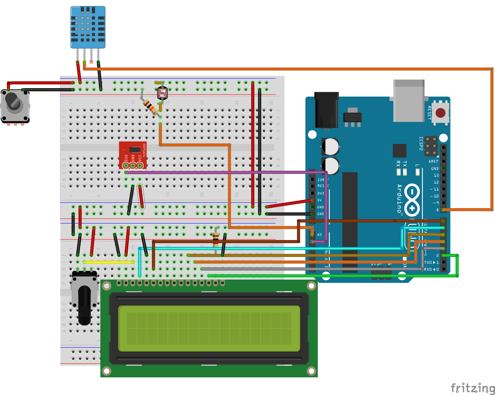

# Visuino, Humidity / Temperature, Ambient Light and Photoresistor Sensors

This folder is directed to the following youtube video:

[Visuino, Shift Register, LED Bar, Encoder and more](https://youtu.be/bYEmDyWL-7s).

Below you can find the fritzing sketch for the schematics.

You can also find the Visuino code in this repo.

