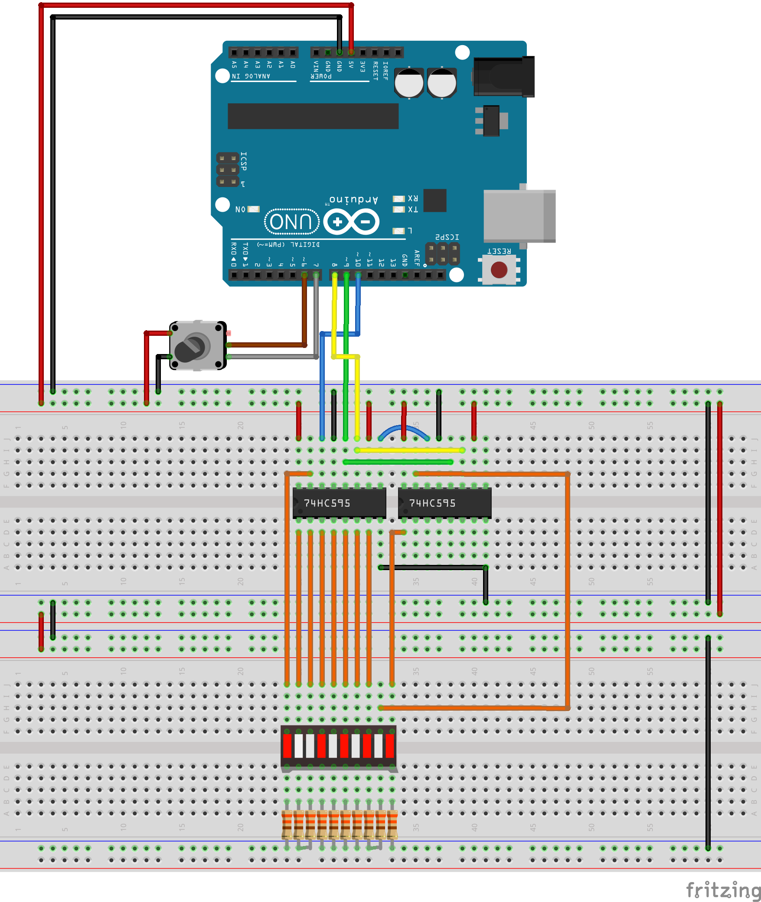

# Visuino, Shift Register, LED bar & Encoder

This folder is directed to the following youtube video:

[Visuino, Shift Register, LED Bar, Encoder and more](https://youtu.be/DqWPlKA1Sew).

Below you can find the fritzing sketch for the schematics.

You can also find the Visuino code in this repo.

